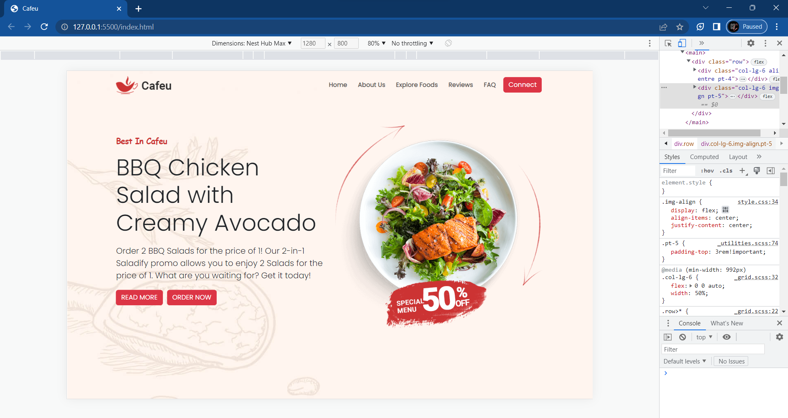

# Homepage using Bootstrap-5

## Description

This homepage was built mainly by using Bootstrap with HTML and CSS. A homepage developed using Bootstrap provides a variety of benefits including faster and more efficient development, responsive and mobile-first design, consistent and professional look across different browsers and devices.

## Technologies Used

* HTML
* CSS
* Bootstrap 5

## Installation and Usage

1. Clone the repository <a href="https://github.com/Thirumalaikumar-M/Homepage-Bootstrap.git">https://github.com/Thirumalaikumar-M/Homepage-Bootstrap.git</a>
2. Open `index.html` on your preferred web browser
3. Or you can visit the <a href="https://thirumalaikumar-m.github.io/Homepage-Bootstrap/">Github hosted page</a>

## Screenshots

## Contributions

Contributions are welcome! Please open an issue or submit a pull request if you have any suggestions or improvements.

## License

This application is released under the  Feel free to use, modify and distribute your code under the terms of the MIT license.
